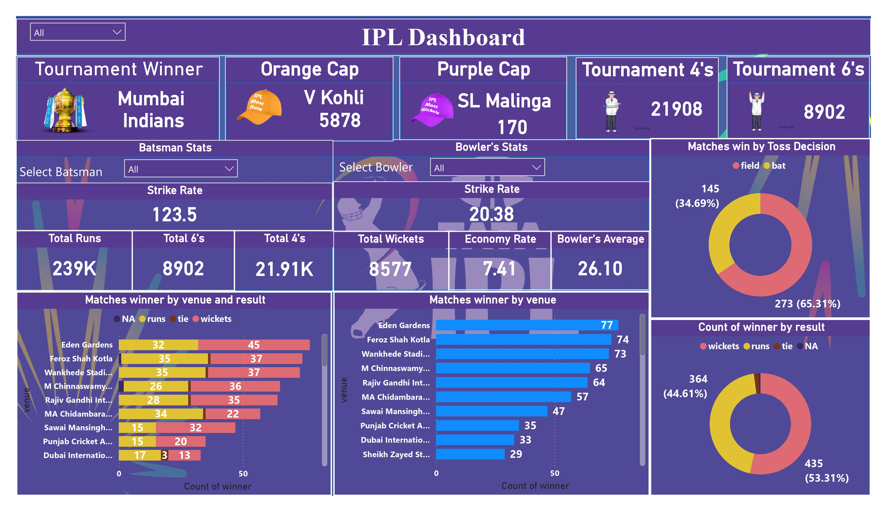

# IPL Analytics Dashboard

## Project Overview

This project analyzes Indian Premier League (IPL) data from **2008–2020** using **Power BI**.
The dashboard provides insights into team performance, player statistics, match outcomes, and venue performance.

The objective of this project is to demonstrate **data analysis, data visualization, and sports analytics** using real-world cricket data.

---

## Tools & Technologies

• Power BI
• Data Cleaning
• Data Visualization
• Sports Data Analytics

---

## Dataset

The dataset contains IPL match and ball-by-ball data from **2008–2020**.

Dataset includes:

* Match details
* Batting statistics
* Bowling statistics
* Player performance
* Venue information
* Match results

Dataset File:
`IPL-Data.zip`

---

## Key Insights

* **Mumbai Indians** have won the highest number of IPL titles.
* **Virat Kohli** holds the record for the most runs scored (Orange Cap).
* **Lasith Malinga** leads with the highest wickets taken (Purple Cap).
* Teams choosing to **field first after winning the toss win more matches**.
* Venue analysis shows different match outcomes across stadiums.

---

## Dashboard Preview

---

## Project Files

Power BI Dashboard
`IPL-Analytics-Dashboard.pbix`

Dataset
`IPL-Data.zip`

Project Report
`IPL-Analytics-Dashboard-Report.pdf`

---

## How to Use

1. Download the `.pbix` file.
2. Open it using **Power BI Desktop**.
3. Explore the interactive dashboard using filters and slicers.

---

## Author

Harshit Singh
